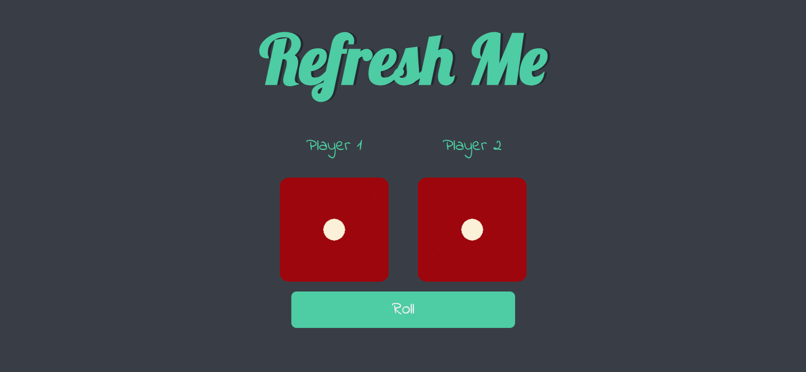
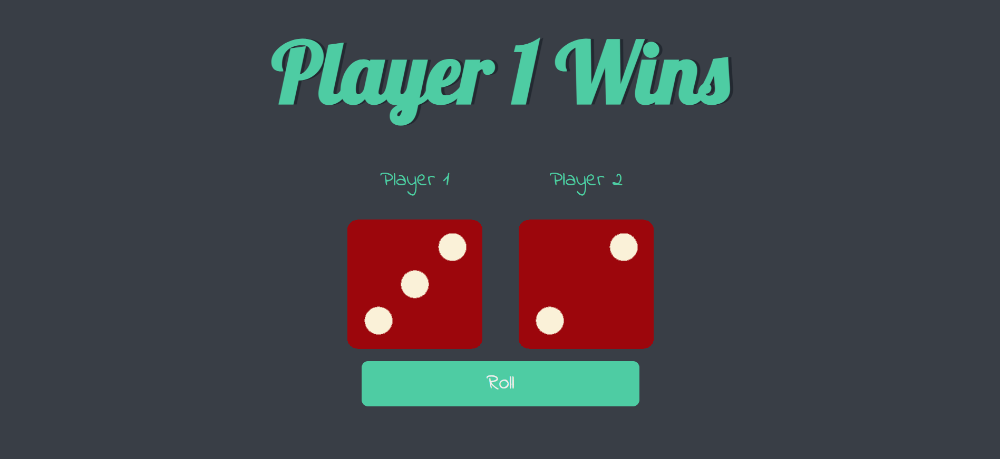

# Dice-Game
The Dice Game features an engaging interface created with HTML and CSS, and interactive functionality using JavaScript. Players can roll the dice by clicking a button, and the game dynamically updates to display the results and declare the winner or a draw. The design includes responsive elements, custom fonts, and styling for a visually appealing user experience.

## Features
<ul>-Engaging and responsive interface created with HTML and CSS.</ul>
<ul>-Interactive dice roll simulation using JavaScript.</ul>
<ul>-Displays the result of each roll dynamically.</ul>
<ul>-Announces the winner or declares a draw based on dice results.</ul>
<ul>-Button click functionality for rolling the dice.</ul>

## Screenshot
<ul></ul>
